# Kaggle Home Credit Risk Default

The goal of this project is to improve the ability to predict credit default or repayment ability of Home credit's customers. This is my team's solution to the Kaggle's home credit default competition.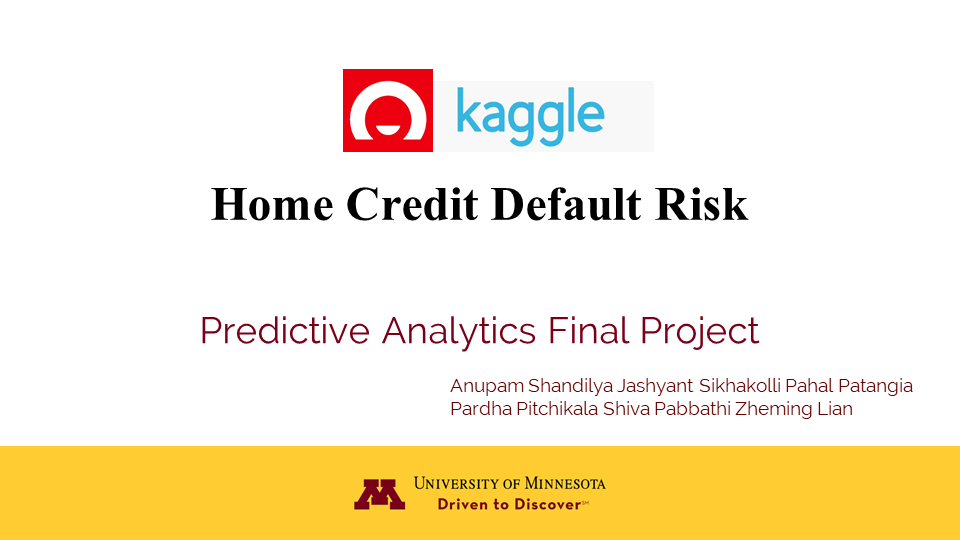

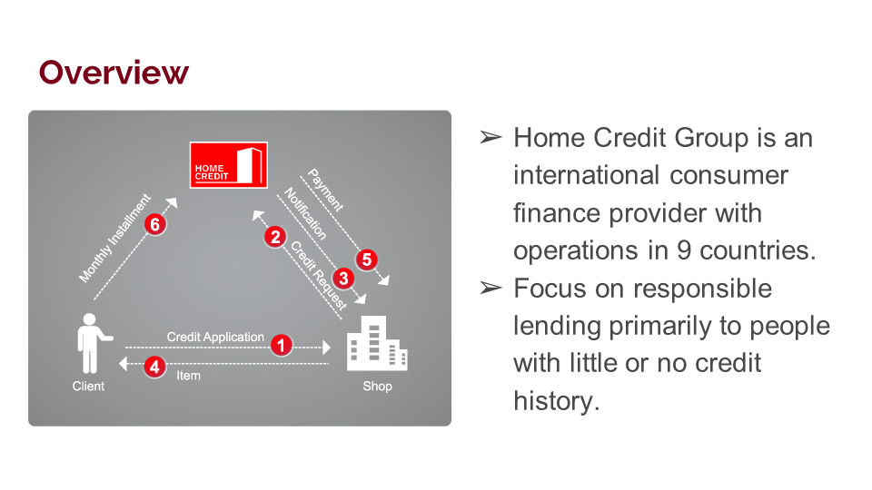

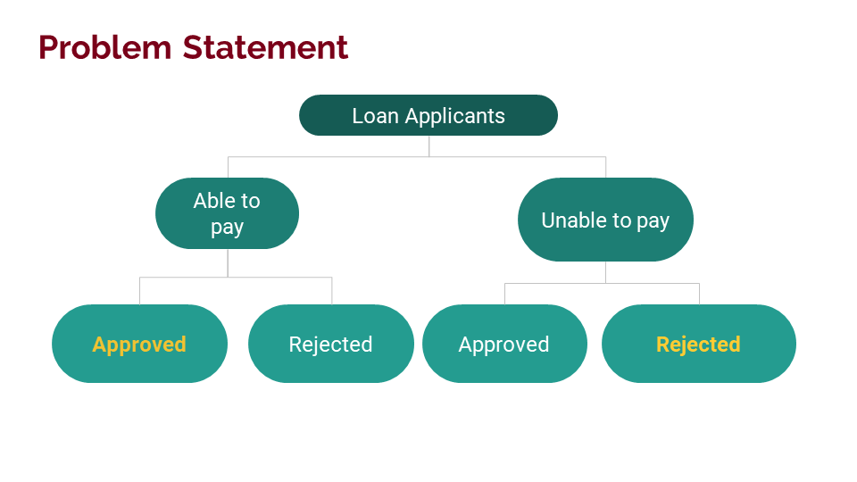

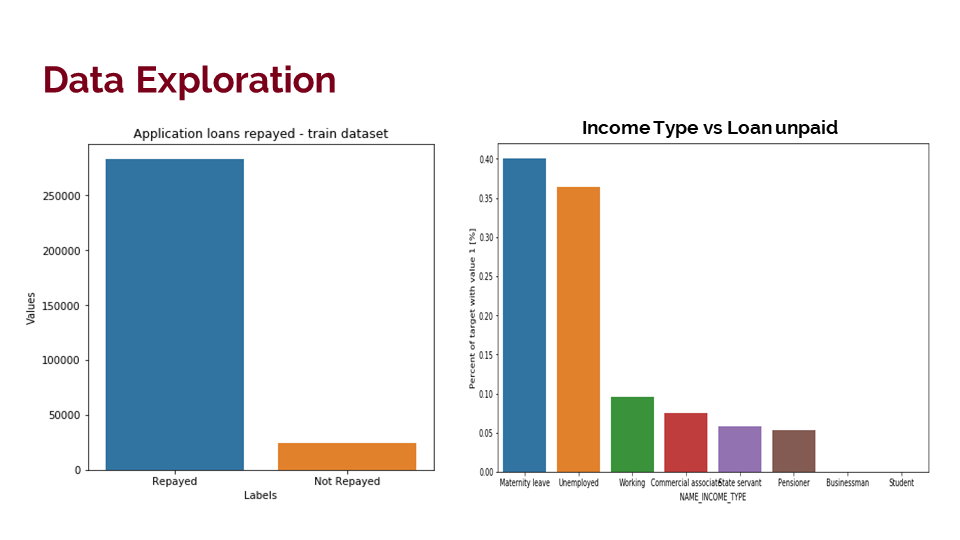

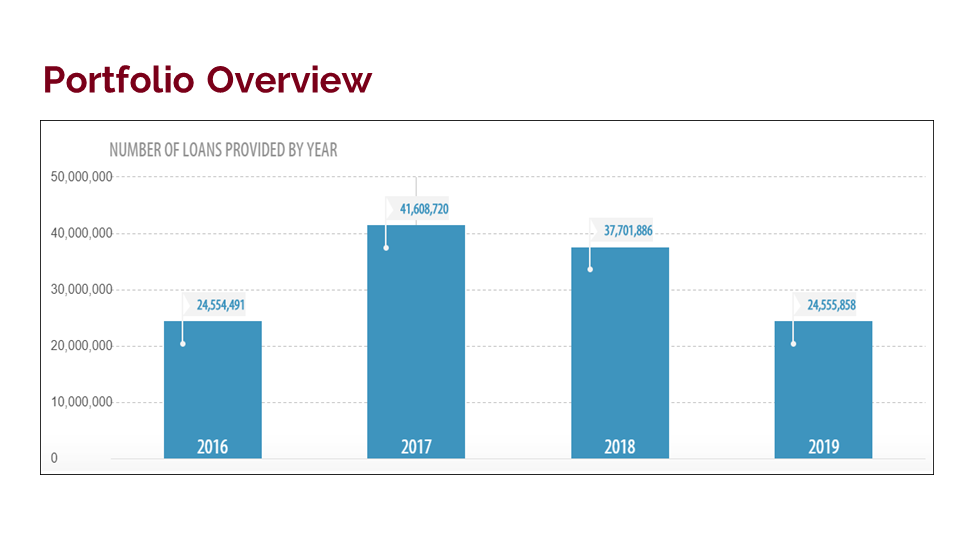

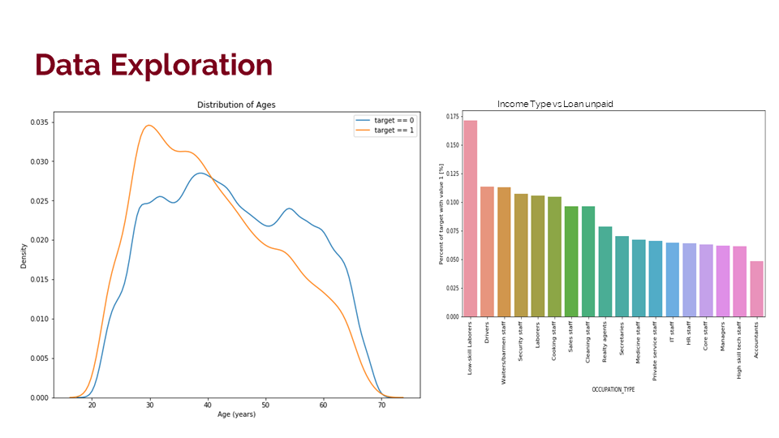

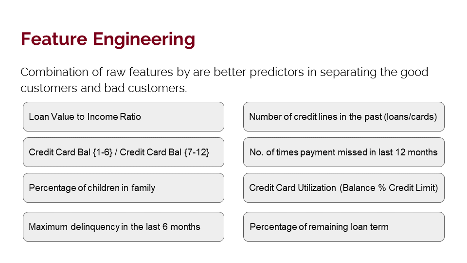

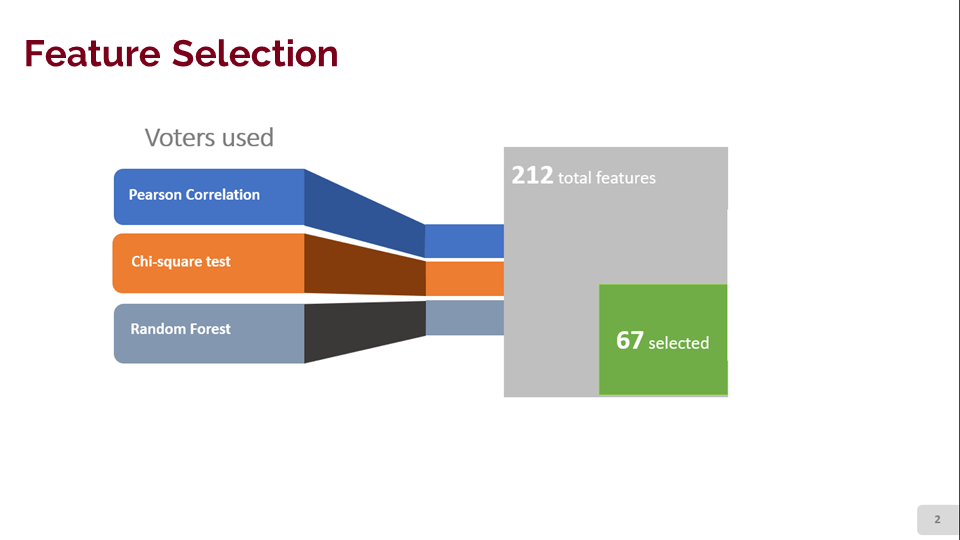

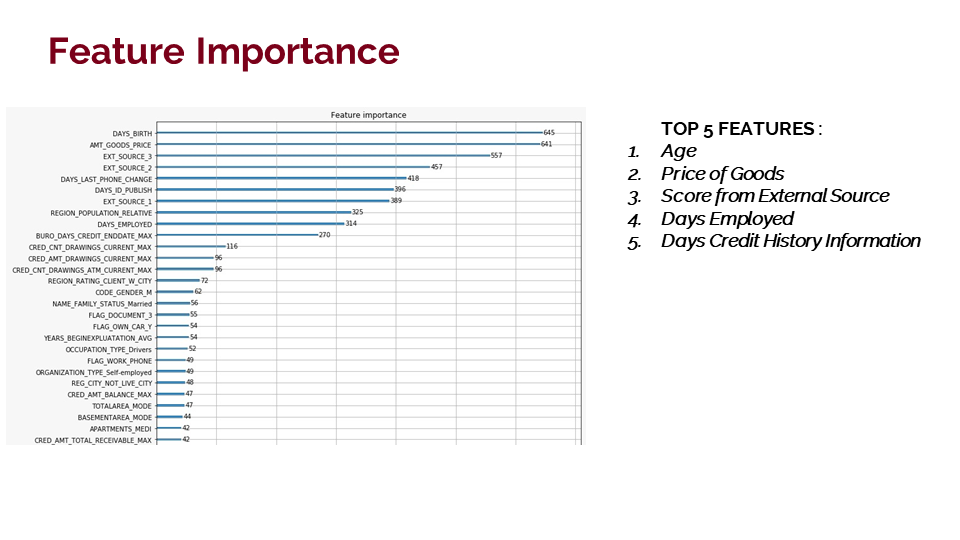

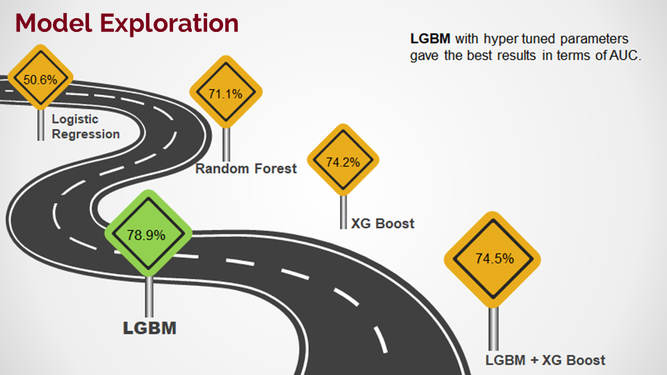

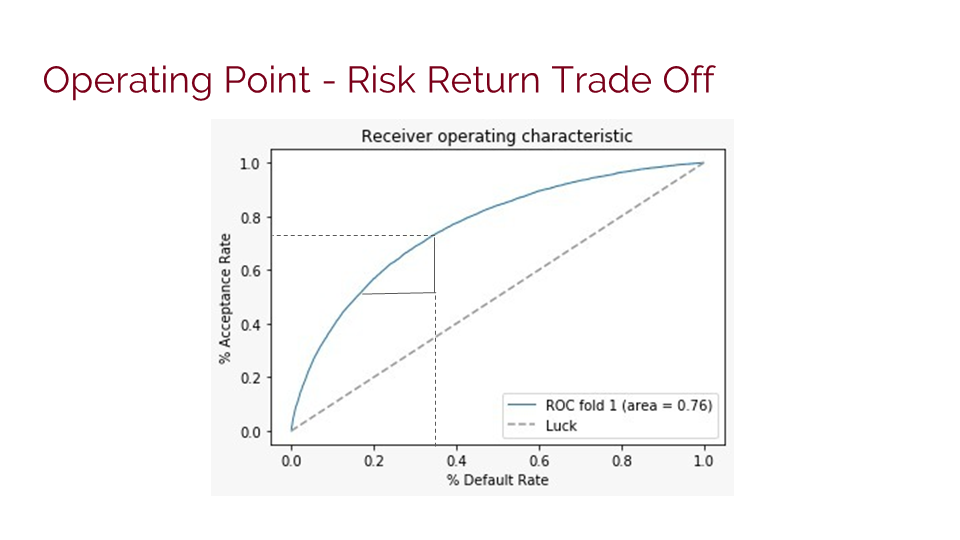

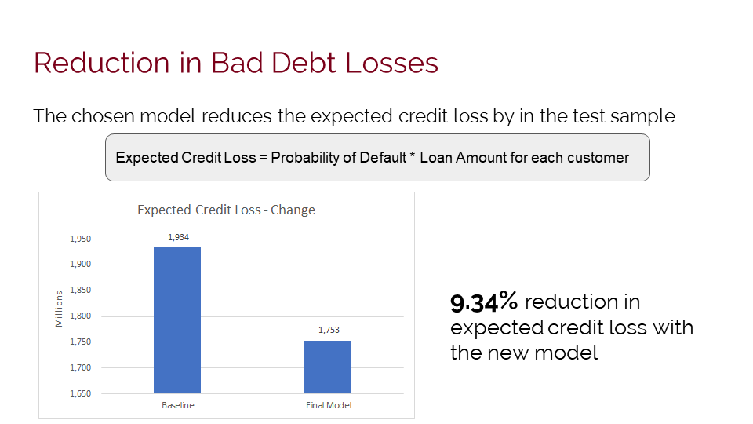

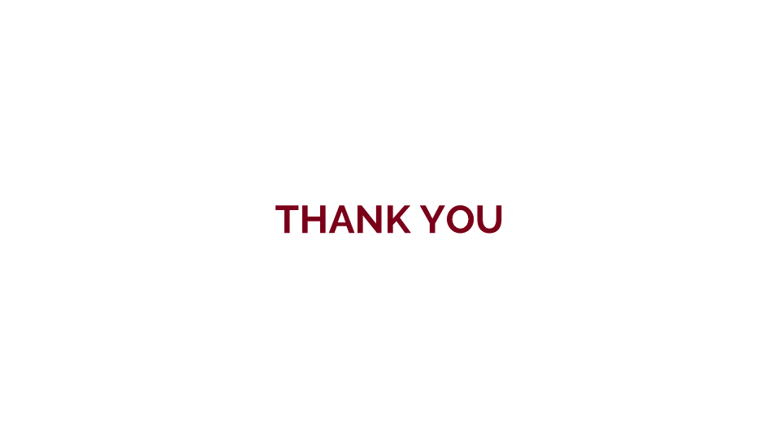